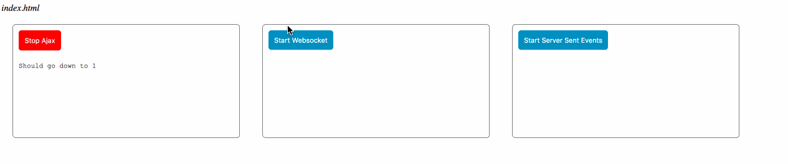

# @TODO: update documentation

# Node-WebAPIs
This is a proof of concept of process monitoring via node and browser events

# This project demos the usage of Ajax Polling, Websocktes and Server Sent Events

# Demo

